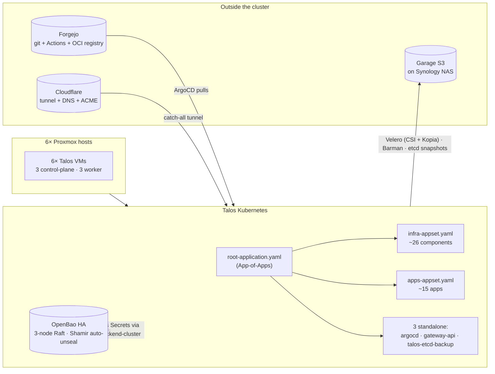

<div align="center">

# 🏠 Homelab — Talos + ArgoCD on Proxmox

A single-tenant home cluster. Six Talos VMs across six Proxmox nodes, managed by ArgoCD, with OpenBao as the only source of truth for secrets. Provisioned by Terraform, monitored by VictoriaMetrics, backed up to Garage S3 on a Synology NAS.

[](https://deepwiki.com/VizzleTF/homelab)

</div>

> This GitHub copy is a sanitized read-only mirror. Origin lives on a private Forgejo instance. After every merge to `main`, a Forgejo Actions workflow runs `gitleaks`, sanitizes through `git filter-repo --replace-text`, and force-pushes to GitHub. SHAs do not match upstream, and some literals (domains, IPs, emails) are replaced.


---

## 📖 Design choices

- Single operator. No PR review process, no second admin account, no destructive-op guards.
- Six N100-class Proxmox boxes, not a rack. RAM is the binding constraint, not CPU.
- The Synology NAS is independent of the cluster: its own TLS (`acme.sh`), its own DNS (OpenWrt), its own reverse-proxy (DSM nginx). Cluster failure does not affect stored data.

---

## ⚙️ Stack

| Layer                 | Choice                                  | Notes                                                                |
|-----------------------|-----------------------------------------|----------------------------------------------------------------------|
| Hypervisor            | Proxmox VE                              | Six nodes, host config in Ansible                                    |
| VM provisioning       | Terraform + `bpg/proxmox`               | Inventory in `terraform_proxmox/configs/vms.yaml`                    |
| Cluster OS            | Talos Linux                             | Immutable, no SSH, API-only via `talosctl`                           |
| CNI                   | Cilium 1.19                             | eBPF, kube-proxy replacement, WireGuard pod-to-pod, Hubble UI        |
| Ingress               | Cilium Gateway API v1.4.1               | Three Gateways: public, internal, TLS-passthrough                    |
| External access       | Cloudflared tunnel                      | Catch-all into the public Gateway; external-dns writes CNAMEs        |
| TLS                   | cert-manager + Cloudflare DNS-01        | One wildcard secret in `kube-system`, every Gateway references it    |
| Storage               | Longhorn                                | Default class, 2 replicas, `Retain` reclaim                          |
| Secrets               | OpenBao HA + External Secrets Operator  | MPL 2.0 fork of Vault 1.14.x, API-compatible; KV v2 mount `home`     |
| Databases             | CloudNativePG                           | Shared PG17, plus a dedicated Immich cluster for `pgvector`          |
| GitOps                | ArgoCD                                  | App-of-Apps + two ApplicationSets (infra + apps)                     |
| Observability         | VictoriaMetrics + VictoriaLogs + Vector | Grafana, Alertmanager into Telegram, Robusta for K8s-aware enrichment |
| Dependency updates    | Renovate                                | In-cluster CronJob, opens PRs against Forgejo                        |
| Backups               | Velero + Barman                         | Velero handles PVCs and K8s state (CSI snapshot data movement through Kopia, with `talosctl etcd snapshot` running as a Velero pre-hook for the control plane); Barman handles Postgres WAL+PITR. Everything lands in one Garage bucket, mirrored daily to OVH Frankfurt. |

---

## 📊 CNCF maturity

Where the stack sits on the [CNCF Landscape](https://landscape.cncf.io/):

| Layer             | Project                | CNCF maturity                       |
|-------------------|------------------------|-------------------------------------|
| CNI               | Cilium                 | ✅ Graduated                         |
| Container runtime | containerd (via Talos) | ✅ Graduated                         |
| GitOps            | Argo CD                | ✅ Graduated                         |
| TLS               | cert-manager           | ✅ Graduated                         |
| Autoscaling       | KEDA                   | ✅ Graduated                         |
| Storage           | Longhorn               | 🟡 Incubating                        |
| Secrets sync      | External Secrets       | 🟢 Sandbox                           |
| Database operator | CloudNativePG          | 🟢 Sandbox                           |
| DNS sync          | ExternalDNS            | Kubernetes SIG (under K8s Graduated) |
| Secrets backend   | OpenBao                | OpenSSF sandbox (MPL 2.0, fork of Vault 1.14.x) |
| Backup            | Velero                 | 🟢 Sandbox                           |
| CSI snapshotter   | kubernetes-csi/external-snapshotter | Kubernetes SIG (under K8s Graduated) |
| Observability     | VictoriaMetrics / Logs | Not CNCF                             |

---

## 🗺️ Architecture



---

## 🗃️ Repository layout

```
argocd/
├── root-application.yaml             # App-of-Apps root
├── infrastructure/                   # 1 ApplicationSet + 3 standalone Applications
│   ├── infra-appset.yaml             # git.files generator over argocd/infra/*/config.yaml
│   ├── argocd-application.yaml       # self-management
│   ├── gateway-api.yaml              # CRDs pinned to v1.4.1 (Cilium 1.19 compat)
│   └── talos-etcd-backup.yaml
├── applications/
│   └── apps-appset.yaml              # git.files generator over argocd/apps/*/config.yaml
├── apps/                             # Per-app self-contained folder (auto-discovered)
│   └── <app>/
│       ├── config.yaml               # chart, repoURL, targetRevision, namespace, wave, flags
│       ├── values.yaml               # chart values + homelab-common: section
│       ├── homelab-values.yaml       # optional split (when chart schema is strict)
│       ├── cnpg-values.yaml          # optional dedicated CNPG cluster (only immich today)
│       └── manifests/                # optional raw K8s yamls (extraManifests: true)
├── infra/                            # Same shape as apps/, per-component
├── values/
│   ├── infrastructure/argocd.yaml    # values for the standalone argocd Application
│   └── shared/global.yaml            # $values target for homelab-common globals
└── manifests/
    └── infrastructure/talos-etcd-backup/

charts/homelab-common/                # In-house Helm chart: HTTPRoute, ExternalSecret,
                                      # Backup CronJob, RBAC, LimitRange, CNPG Database,
                                      # simple workloads. Published to the Forgejo OCI
                                      # registry; ArgoCD pulls from there, not from this path.

ansible/                              # PVE host config
terraform_proxmox/                    # VM provisioning (Talos + cloud-init devboxes)
scripts/                              # forgejo-pr.sh, talos-upgrade.sh, vm.sh, …
.forgejo/workflows/ci.yaml            # yamllint, helm-lint, gitleaks, mirror-to-github
.claude/skills/                       # Claude Code skills used to operate this repo
CLAUDE.md                             # Project-wide conventions
```

To add a new app: `mkdir argocd/apps/<name>`, then drop in `config.yaml` and `values.yaml`. The ApplicationSet auto-discovers it on the next reconcile; the appset YAML stays untouched. Same flow for infra components under `argocd/infra/`. Chart versions are pinned in each `config.yaml` (`targetRevision:`); Renovate opens the bump PRs.

---

## 🚦 Sync waves

ArgoCD deploys in strict order. Values come from `argocd/{infra,apps}/*/config.yaml` (`wave:`) and the standalone Application manifests under `argocd/infrastructure/`.

| Wave    | What lands                                                                                              | Why                                                                                                                                              |
|---------|---------------------------------------------------------------------------------------------------------|--------------------------------------------------------------------------------------------------------------------------------------------------|
| **-10** | ArgoCD self-management, Gateway API CRDs, PreSync `ExternalSecret`s for charts with pre-install hooks   | ArgoCD reconciles itself first; Gateway API CRDs before any Gateway resource; hook-time ESO secrets must exist before chart `pre-install` Jobs run |
| **-5**  | Cilium, cert-manager (+ ClusterIssuer)                                                                  | Networking and cert plumbing first; everything HTTP-facing depends on this                                                                       |
| **-4**  | Longhorn, OpenBao, csi-snapshotter                                                                      | Storage before stateful workloads; OpenBao before ESO can resolve any external secret; CSI snapshotter (kubernetes-csi external-snapshotter) ships VolumeSnapshot CRDs which Velero needs |
| **-3**  | kubelet-csr-approver, metrics-server                                                                    | Cluster-wide utilities the rest of the stack assumes                                                                                             |
| **-2**  | External Secrets Operator, CNPG operator, KEDA, External DNS (Cloudflare + OpenWrt), VictoriaMetrics    | ESO before any `ExternalSecret` reconciles; operators before instances                                                                           |
| **-1**  | Node Feature Discovery, intel-device-plugins operator, KEDA HTTP add-on, VictoriaLogs                   | Layered atop the wave -2 prerequisites                                                                                                           |
| **0**   | Cloudflared, descheduler, pve-exporter, intel-device-plugins-gpu, **velero**, reloader                  | Optional / leaf infrastructure                                                                                                                   |
| **1**   | CNPG clusters, valkey, Robusta, openbao-autounseal, talos-etcd-backup, **velero-ui**                    | DB instances after the operator; tunnel + observability after the cluster is up                                                                  |
| **2**   | Apps (authentik, forgejo, nextcloud, immich, vaultwarden, lampac, may, omniroute, …), Renovate          | Auth and consumer apps after every dependency above                                                                                              |
| **3**   | forgejo-runner                                                                                          | Needs the Forgejo server reachable first                                                                                                         |

---

## 🖥️ Hardware

Six Proxmox nodes, each hosting one Talos VM:

| Role          | Count | vCPU  | RAM       | Disk        |
|---------------|-------|-------|-----------|-------------|
| control-plane | 3     | 3     | 12 GiB    | 125–300 GB  |
| worker        | 3     | 3–4   | 6–12 GiB  | 100–300 GB  |

Per-node storage is Longhorn (2 replicas, default class). Cold storage and backups live off-cluster on a Synology NAS, exposed as Garage S3 on a dedicated DSM volume with a local certificate.

---

## 🌐 Networking

```
Internet  →  Cloudflare tunnel (cloudflared deployment in-cluster)
                ↓ catch-all
            cilium-gateway              public hosts        (10.11.10.137)

LAN       →  cilium-gateway-internal    LAN-only            (10.11.10.138)
LAN + TLS →  cilium-gateway-tls         TLSRoute passthrough (10.11.10.139)
```

Three L3 subnets, no L2 announcements:

| Subnet | Role |
|---|---|
| `10.11.10.0/24` | LB IP pool — Service `LoadBalancer` IPs, **L3-only** (no L2 segment), announced via BGP |
| `10.11.11.0/24` | Servers VLAN — k8s nodes, Talos VIP, PVE hosts |
| `10.11.12.0/24` | LAN — Wi-Fi/DHCP clients, NAS Synology, router mgmt |

Cilium peers eBGP with OpenWrt (BIRD2) from every node (ASN `65010` ↔ `65000`). Each LB IP is advertised as a `/32` with ECMP across all six nodes; `externalTrafficPolicy: Local` services are advertised only from the node hosting the pod, so single-replica workloads keep source IP without a kube-proxy hop. BIRD config is generated from `scripts/openwrt-bgp-setup.sh` — see `obsidian/111 Memory/Cilium BGP.md` for the operational guide.

One wildcard cert lives in `kube-system/wildcard-tls`; every Gateway references it. cert-manager renews it via Cloudflare DNS-01.

external-dns writes records both ways: Cloudflare for public hosts, OpenWrt for the LAN. The OpenWrt instance runs with `registry: noop + policy: upsert-only` because dnsmasq is A-only — see `obsidian/111 Memory/External DNS OpenWrt.md`.

To expose a new public service, add `httpRoutes:` to the app's `values.yaml`. `homelab-common` renders the HTTPRoute, external-dns picks up the host, and the tunnel routes it.

---

## 🔐 Secrets & backups

OpenBao (MPL 2.0 fork of HashiCorp Vault 1.14.x under OpenSSF sandbox, API-compatible) is the single source of truth for secrets. It runs in HA mode (3-node Raft) and auto-unseals via Shamir keys held by a `pytoshka/vault-autounseal` sidecar. The unseal material has an off-cluster copy in Vaultwarden.

External Secrets Operator renders Kubernetes `Secret` objects on demand from OpenBao paths shaped like `home/homelab/k8s/<ns>/<app>`.

Backups go to dedicated Garage S3 buckets on Synology (`s3.example.com` — `velero-backups`, `cnpg-backups`, `terraform-state`), each mirrored daily to OVH Frankfurt. Two non-overlapping layers cover everything — see [Backups](#-backups) below.

Garage requires `AWS_DEFAULT_REGION=garage` in the env; without it, `HeadBucket` returns 400. This catches every S3 client (Barman, Velero AWS plugin, Terraform S3 backend, rclone OVH-mirror CronJobs).

---

## 💾 Backups

Primary bucket is Garage on Synology (`velero-backups` + `cnpg-backups`), each with a daily off-site mirror to OVH Frankfurt. Two non-overlapping layers: Velero handles PVCs, K8s state and `talosctl etcd snapshot` (control plane, via Velero pre-hook on a holder pod); CNPG Barman handles Postgres WAL+PITR.

| Workload | Backup CR | Cron UTC | TTL | Method | Hook |
|---|---|---|---|---|---|
| OpenBao Raft state | `openbao-daily` | 02:05 | 30d | CSI snapshot data movement | pre: `bao operator raft snapshot save` drops a consistent `.snap` file into the PVC right before the CSI snapshot fires. Policy `snapshot` needs `read+sudo` on `sys/storage/raft/snapshot`. |
| Cleanbot data PVC (SQLite) | `cleanbot-daily` | 02:25 | 30d | CSI snapshot data movement | pre: `python3 -c 'sqlite3.Connection.backup(...)'` — the image lacks `sqlite3` CLI but ships Python, whose stdlib exposes the same SQLite online-backup C API; post-hook removes the `.bak` from the PVC |
| Nextcloud data PVC | `nextcloud-daily` | 02:30 | 30d | CSI snapshot data movement | pre: `occ maintenance:mode --on`, post: `--off \|\| true` (the `\|\| true` keeps the site from getting stuck in read-only if the post-hook fails) |
| May data PVC (SQLite) | `may-daily` | 02:35 | 30d | CSI snapshot data movement | pre: `sync` — SQLite WAL gives crash-consistent recovery over the atomic PVC snapshot |
| Forgejo data PVC (git + LFS + attachments) | `forgejo-daily` | 02:40 | 30d | CSI snapshot data movement | pre: `forgejo manager flush-queues --timeout 30s; sync` — drains in-memory webhook/indexer queues before the snapshot fires; repo Postgres metadata sits on CNPG Barman |
| Omniroute data PVC (SQLite) | `omniroute-daily` | 02:45 | 30d | CSI snapshot data movement | — KEDA scales the pod to zero, so there's no container to exec into; CSI snapshots the PVC directly |
| Vaultwarden data PVC (SQLite) | `vaultwarden-daily` | 02:50 | 30d | CSI snapshot data movement | pre: `sqlite3 /data/db.sqlite3 ".backup /data/db.sqlite3.bak"` from a tiny alpine+sqlite sidecar (`sqlite-helper`) — the upstream Debian-slim image has no `sqlite3` CLI; post-hook removes the `.bak` from the PVC |
| Rss-to-telegram-bot data PVC (SQLite) | `rss-to-telegram-bot-daily` | 02:55 | 30d | CSI snapshot data movement | pre: `sync` |
| Immich library (~185 GiB) | `immich-daily` | 03:00 | 30d | **File System Backup** — Longhorn can't clone a 185 GiB RWX volume within Velero's 15-min timeout, so node-agent mounts the live PVC via kubelet hostPath and Kopia reads straight from it. `resourcePolicy` skips the ML model cache PVC. | pre: `sync` |
| etcd (Talos control plane) | `talos-etcd-daily` (Velero) | 04:15 | 30d | A holder Deployment (`talos-etcd-snapshotter`, kube-system) keeps a Longhorn PVC mounted. The Velero pre-hook execs `talosctl etcd snapshot` on the pod, iterating over CP nodes `10.11.11.{101,102,103}` until one responds, then writes `etcd-<ts>.snap` to the PVC. Velero captures the PVC via CSI to Garage; the OVH mirror picks it up next morning. Local on-PVC retain is 7 snapshots, off-PVC retention rides on Velero TTL. Only path back if the cluster is gone — Velero talks to apiserver, not etcd. | pre: `talosctl etcd snapshot /backup/.velero/etcd-<ts>.snap` |
| Postgres (cnpg + immich-cluster) | CNPG Barman | continuous WAL + scheduled base | 7d | `s3://cnpg-backups/<cluster>/`. PITR down to the minute. | — |
| K8s runtime state (Secrets, CR `.status`, ESO renders, cert-manager Orders) | `cluster-state-weekly` | sun 04:00 | 90d | Manifests only, no PVC data. About 100 KB per backup. | — |
| Off-site mirror (Garage → OVH Frankfurt) | `velero-bucket-mirror-ovh` CronJob | 06:00 | — | `rclone sync garage:velero-backups → ovh:vaka-homelab/velero/`. Mounted as a second BSL `ovh-backup` with `accessMode: ReadOnly`, so a compromised cluster credential can't wipe the off-site copy. | — |

### Velero specifics

- **Schedule CRs live per-app**, rendered by the `homelab-common` chart 1.8.1 (`veleroSchedules:` section in each app's values). Only the cluster-wide `cluster-state-weekly` lives in `argocd/infra/velero/manifests/`.
- **Chart defaults** (any field overridable per-app): ttl 720h, storageLocation garage-default, snapshotMoveData true, csiSnapshotTimeout 15m, itemOperationTimeout 4h, defaultVolumesToFsBackup false. `includedNamespaces` defaults to `[.Release.Namespace]`.
- **node-agent DaemonSet** runs on workers only (`nodeSelector: node-role.kubernetes.io/worker`).
- **Data-mover backup pods** also land on workers — `node-agent-config` ConfigMap (`loadAffinity` with `control-plane: DoesNotExist`), wired up through the `--node-agent-configmap=node-agent-config` flag on node-agent. The ConfigMap value must be **JSON**, not YAML — Velero parses it with `json.Unmarshal` and silently falls back to defaults on YAML.
- **CSI snapshotter**: kubernetes-csi/external-snapshotter v8.5.0 deployed standalone. Longhorn 1.11 ships the driver but not the CRDs, so they have to come from somewhere.
- **Kopia repo encryption**: passphrase lives in the `velero-repo-credentials` Secret, Velero generates it on first backup. Lose that Secret and the backups in Garage are unreadable.

### Restore

```bash
# Into a test namespace (safe):
velero restore create --from-backup <name> \
  --namespace-mappings vaultwarden:vw-test

# In-place (DANGEROUS — overwrites live data):
velero restore create --from-backup <name> --existing-resource-policy=update
```

Full runbook in `obsidian/113 Backups/Velero Operator Guide.md`. Two scenarios it covers:

- single namespace lost → `velero restore` with a namespace mapping into a sandbox, verify, then redo in-place
- whole cluster gone → restore the last `talos-etcd-daily` Velero backup to a sandbox ns, extract the `.snap` from the restored PVC, `talosctl bootstrap --recover-from` on a fresh CP VM → ArgoCD rebuilds infra → CNPG restores Postgres from Barman → Velero restores the rest in priority order (vaultwarden → nextcloud → forgejo → immich)

---

## 🛠️ Forgejo-first workflow

Origin is a self-hosted Forgejo instance. The GitHub mirror is read-only.

```
local branch
   │ push
   ▼
Forgejo
   │ PR
   ▼
gitleaks gate
   │ squash-merge
   ▼
filter-repo sanitize
   │ push
   ▼
GitHub mirror
```

Direct push to `main` is blocked by branch protection; changes go through a PR. Pre-commit runs gitleaks v8.30.1 plus a filename blocklist. Forgejo Actions runs three checks on every PR: `yamllint`, `helm-lint`, `gitleaks`. All three must be green to merge.

After merge, gitleaks re-runs on `main` because it scans the full history; a leak in a PR's history would poison the gate permanently. Then `mirror-to-github` applies `MIRROR_SANITIZE_RULES` (a multiline `<old>==><new>` Forgejo Actions secret) and force-pushes to GitHub.

`scripts/forgejo-pr.sh open|merge` wraps the API calls with a per-user token, so squash merges are attributed to the correct account instead of the branch-protection admin token.

---

## 🚜 Provisioning a node

Three commands once the prep is done:

1. Add an entry to `terraform_proxmox/configs/vms.yaml`.
2. `terraform -chdir=terraform_proxmox apply` builds the VM, applies the Talos machine config, and joins the cluster.
3. `kubectl get nodes` to verify. Cilium, Longhorn and NFD onboard the new node automatically.

Full procedure (including the Talos secrets-cascade gotcha: any `talos_machine_secrets` mutation invalidates pod SA tokens cluster-wide, and the cilium / CSI / controller rollouts that follow take roughly fifteen minutes) is in the `provisioning-talos-node` Claude Code skill.

---

## 🧪 Gotchas

- Gateway API v1.5 standard CRDs do not work with Cilium 1.19. Cilium 1.20 hard-fails on `backendServiceTLSRouteIndex` against v1alpha2 with `served=false`. Pin to v1.4.1 (`config/crd/experimental`) until Cilium catches up.
- `ghcr.io/siderolabs/kubelet:<k8s-ver>` lags upstream Kubernetes releases. Do not bump the K8s version on the Talos side until the image is published; `scripts/talos-upgrade.sh check` HEADs the manifest first.
- Mutating Talos secrets triggers a cluster-wide auth cascade. Cilium agents lose apiserver, everything serial-fails `Unauthorized`. Expect roughly fifteen minutes of rollout afterwards.
- OpenWrt mt76 hardware flow-offload breaks WiFi roaming. FT/BTM transitions hang for ~60s under conntrack timeout. Disable HW offload, keep SW offload.
- `vmagent`'s default 16 MiB scrape-size limit is too small for kube-apiserver `/metrics`. Bump `maxScrapeSize` to 64 MB; otherwise `apiserver_request_*_bucket` is silently dropped and the SLO rules tied to it stop firing.
- Forgejo Actions runner only emulates the GHES artifact protocol up to v3. Pin `actions/upload-artifact@v3.1.x` and `download-artifact@v3.1.x`. v3.2.0+ uses the v4 protocol and fails with `GHESNotSupportedError`.
- kswapd starves the WiFi driver before it pages. Keep ≥3 GiB of headroom per host.
- `homelab-common` publishes on git tag `homelab-common-v<version>`. Bump `Chart.yaml`, merge to main, push the tag — `.forgejo/workflows/publish-helm.yml` packages and POSTs to the Forgejo Helm Chart Museum (`/api/packages/vizzle/helm/api/charts`). Without the tag the new version never lands in the registry, and ArgoCD will sit on the old chart.

---

## 🤖 Claude Code skills

Routine operations are wrapped as [Claude Code](https://docs.claude.com/en/docs/claude-code/overview) skills under `.claude/skills/`. Each skill is a Markdown runbook the agent loads on demand.

| Skill                       | What it does                                                                            |
|-----------------------------|------------------------------------------------------------------------------------------|
| `provisioning-talos-node`   | Full node-add flow, from the first prompt to `Ready` status                              |
| `replacing-talos-node`      | Drain, forfeit leadership, recreate the trio, clean up Longhorn                          |
| `upgrading-talos`           | `talosctl` patch and minor upgrades, gated through ghcr manifest checks                  |
| `creating-garage-bucket`    | Provisions a Garage S3 bucket + key on the Synology, stores credentials in OpenBao       |
| `renewing-synology-cert`    | `acme.sh` + Cloudflare DNS-01, then reloads DSM nginx via `synow3tool`                   |
| `rotating-proxmox-acme`     | Rotates one CF token across PVE, cert-manager, external-dns, OpenBao, Synology in one run |
| `scaffolding-app`           | Boilerplate for a new app: values, HTTPRoute, ExternalSecret, ArgoCD wiring              |
| `scaffolding-authentik-oidc`| New OIDC client: secret, dual OpenBao paths, blueprint files, ESO wiring                 |
| `triaging-alerts`           | Pulls firing alerts from VictoriaMetrics and groups them by severity                     |
| `checking-cluster-health`   | One-shot overview: nodes, pods, PVCs, certs, ArgoCD sync                                 |

Full list, plus reference docs, hooks and MCP wiring, lives under `.claude/`. `CLAUDE.md` at the root contains project-wide conventions.

---

## 🏗️ Work in progress

- [ ] Local LLM behind KEDA scale-to-zero
- [ ] Cilium 1.20 + Gateway API v1.5 jump (blocked on the `TLSRoute` schema regression)
- [ ] Disaster-recovery drill: drain a worker mid-day, observe recovery

---

## 📚 License

The repository ships as-is for reference. No formal LICENSE file — treat it as "all rights reserved" until one is added.
