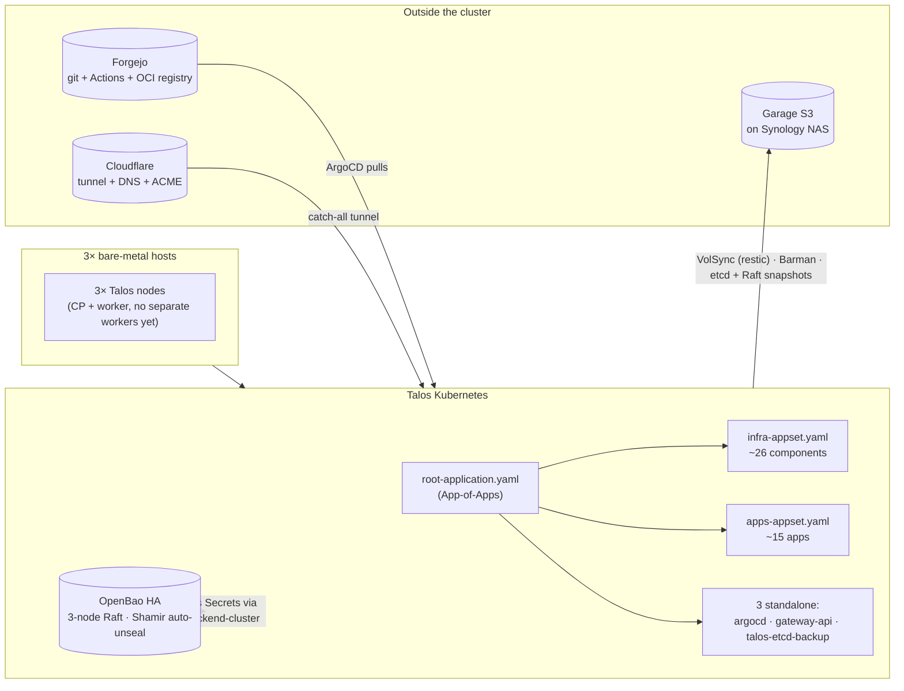

<div align="center">

# 🏠 Homelab — Talos + ArgoCD

A single-tenant home cluster. Three bare-metal Talos nodes managed by ArgoCD, with OpenBao as the only source of truth for secrets. Provisioned by Terraform, monitored by VictoriaMetrics, backed up to Garage S3 on a Synology NAS.

[](https://deepwiki.com/VizzleTF/homelab)

</div>

> This GitHub copy is a sanitized read-only mirror. Origin lives on a private Forgejo instance. After every merge to `main`, a Forgejo Actions workflow runs `gitleaks`, sanitizes through `git filter-repo --replace-text`, and force-pushes to GitHub. SHAs do not match upstream, and some literals (domains, IPs, emails) are replaced.


---

## 📖 Design choices

- Single operator. No PR review process, no second admin account, no destructive-op guards.
- Three N100-class boxes running Talos directly, not a rack. RAM is the binding constraint, not CPU.
- The Synology NAS is independent of the cluster: its own TLS (`acme.sh`), its own DNS (OpenWrt), its own reverse-proxy (DSM nginx). Cluster failure does not affect stored data.

---

## ⚙️ Stack

| Layer                 | Choice                                  | Notes                                                                |
|-----------------------|-----------------------------------------|----------------------------------------------------------------------|
| Cluster OS            | Talos Linux (bare-metal)                | Immutable, no SSH, API-only via `talosctl`; provisioned by Terraform |
| Provisioning          | Terraform + `siderolabs/talos`          | Per-node `configs/nodes.yaml` in `terraform_talos/`                  |
| CNI                   | Cilium 1.19                             | eBPF, kube-proxy replacement, WireGuard pod-to-pod, Hubble UI        |
| Ingress               | Cilium Gateway API v1.4.1               | Three Gateways: public, internal, TLS-passthrough                    |
| External access       | Cloudflared tunnel                      | Catch-all into the public Gateway; external-dns writes CNAMEs        |
| TLS                   | cert-manager + Cloudflare DNS-01        | One wildcard secret in `kube-system`, every Gateway references it    |
| Storage               | Longhorn                                | Default class, 2 replicas, `Retain` reclaim                          |
| Secrets               | OpenBao HA + External Secrets Operator  | MPL 2.0 fork of Vault 1.14.x, API-compatible; KV v2 mount `home`     |
| Databases             | CloudNativePG                           | Shared PG17, plus a dedicated Immich cluster for `pgvector`          |
| GitOps                | ArgoCD                                  | App-of-Apps + two ApplicationSets (infra + apps)                     |
| Observability         | VictoriaMetrics + VictoriaLogs + Vector | Grafana, Alertmanager into Telegram, Robusta for K8s-aware enrichment |
| Dependency updates    | Renovate                                | In-cluster CronJob, opens PRs against Forgejo                        |
| Backups               | VolSync + Barman                        | VolSync backs every PVC into two independent restic chains — Garage on the NAS and OVH Frankfurt — each with its own encryption key; Barman handles Postgres WAL+PITR. etcd and OpenBao Raft go to both targets as plain snapshot files. |

---

## 📊 CNCF maturity

Where the stack sits on the [CNCF Landscape](https://landscape.cncf.io/):

| Layer             | Project                | CNCF maturity                       |
|-------------------|------------------------|-------------------------------------|
| CNI               | Cilium                 | ✅ Graduated                         |
| Container runtime | containerd (via Talos) | ✅ Graduated                         |
| GitOps            | Argo CD                | ✅ Graduated                         |
| TLS               | cert-manager           | ✅ Graduated                         |
| Autoscaling       | KEDA                   | ✅ Graduated                         |
| Storage           | Longhorn               | 🟡 Incubating                        |
| Secrets sync      | External Secrets       | 🟢 Sandbox                           |
| Database operator | CloudNativePG          | 🟢 Sandbox                           |
| DNS sync          | ExternalDNS            | Kubernetes SIG (under K8s Graduated) |
| Secrets backend   | OpenBao                | OpenSSF sandbox (MPL 2.0, fork of Vault 1.14.x) |
| Backup            | VolSync                | Red Hat / backube (not CNCF)         |
| CSI snapshotter   | kubernetes-csi/external-snapshotter | Kubernetes SIG (under K8s Graduated) |
| Observability     | VictoriaMetrics / Logs | Not CNCF                             |

---

## 🗺️ Architecture


```mermaid
flowchart LR
    subgraph HW["3× bare-metal hosts"]
        Nodes["3× Talos nodes<br/>(CP + worker, no separate workers yet)"]
    end

    subgraph K8s["Talos Kubernetes"]
        Root["root-application.yaml<br/>(App-of-Apps)"]
        Root --> InfraSet["infra-appset.yaml<br/>~26 components"]
        Root --> AppsSet["apps-appset.yaml<br/>~15 apps"]
        Root --> Standalone["3 standalone:<br/>argocd · gateway-api · talos-etcd-backup"]
        Bao[("OpenBao HA<br/>3-node Raft · Shamir auto-unseal")]
    end

    subgraph Out["Outside the cluster"]
        Forgejo[("Forgejo<br/>git + Actions + OCI registry")]
        Garage[("Garage S3<br/>on Synology NAS")]
        CF[("Cloudflare<br/>tunnel + DNS + ACME")]
    end

    HW --> K8s
    Forgejo -- "ArgoCD pulls" --> K8s
    Bao  -- "ESO renders Secrets via openbao-backend-cluster" --> K8s
    K8s    -- "VolSync (restic) · Barman · etcd + Raft snapshots" --> Garage
    CF     -- "catch-all tunnel" --> K8s
```

---

## 🗃️ Repository layout

```
argocd/
├── root-application.yaml             # App-of-Apps root
├── infrastructure/                   # 1 ApplicationSet + 3 standalone Applications
│   ├── infra-appset.yaml             # git.files generator over argocd/infra/*/config.yaml
│   ├── argocd-application.yaml       # self-management
│   ├── gateway-api.yaml              # CRDs pinned to v1.4.1 (Cilium 1.19 compat)
│   └── talos-etcd-backup.yaml
├── applications/
│   └── apps-appset.yaml              # git.files generator over argocd/apps/*/config.yaml
├── apps/                             # Per-app self-contained folder (auto-discovered)
│   └── <app>/
│       ├── config.yaml               # chart, repoURL, targetRevision, namespace, wave, flags
│       ├── values.yaml               # chart values + homelab-common: section
│       ├── homelab-values.yaml       # optional split (when chart schema is strict)
│       ├── cnpg-values.yaml          # optional dedicated CNPG cluster (only immich today)
│       └── manifests/                # optional raw K8s yamls (extraManifests: true)
├── infra/                            # Same shape as apps/, per-component
├── values/
│   ├── infrastructure/argocd.yaml    # values for the standalone argocd Application
│   └── shared/global.yaml            # $values target for homelab-common globals
└── manifests/
    └── infrastructure/talos-etcd-backup/

charts/homelab-common/                # In-house Helm chart: HTTPRoute, ExternalSecret,
                                      # Backup CronJob, RBAC, LimitRange, CNPG Database,
                                      # simple workloads. Published to the Forgejo OCI
                                      # registry; ArgoCD pulls from there, not from this path.

terraform_talos/                      # Bare-metal Talos cluster provisioning
scripts/                              # forgejo-pr.sh, talos-upgrade.sh, vm.sh, …
.forgejo/workflows/ci.yaml            # yamllint, helm-lint, gitleaks, mirror-to-github
.claude/skills/                       # Claude Code skills used to operate this repo
CLAUDE.md                             # Project-wide conventions
```

To add a new app: `mkdir argocd/apps/<name>`, then drop in `config.yaml` and `values.yaml`. The ApplicationSet auto-discovers it on the next reconcile; the appset YAML stays untouched. Same flow for infra components under `argocd/infra/`. Chart versions are pinned in each `config.yaml` (`targetRevision:`); Renovate opens the bump PRs.

---

## 🚦 Sync waves

ArgoCD deploys in strict order. Values come from `argocd/{infra,apps}/*/config.yaml` (`wave:`) and the standalone Application manifests under `argocd/standalone/`.

| Wave    | What lands                                                                                              | Why                                                                                                                                              |
|---------|---------------------------------------------------------------------------------------------------------|--------------------------------------------------------------------------------------------------------------------------------------------------|
| **-10** | ArgoCD self-management, Gateway API CRDs, PreSync `ExternalSecret`s for charts with pre-install hooks   | ArgoCD reconciles itself first; Gateway API CRDs before any Gateway resource; hook-time ESO secrets must exist before chart `pre-install` Jobs run |
| **-5**  | Cilium, cert-manager (+ ClusterIssuer)                                                                  | Networking and cert plumbing first; everything HTTP-facing depends on this                                                                       |
| **-4**  | Longhorn, OpenBao, csi-snapshotter                                                                      | Storage before stateful workloads; OpenBao before ESO can resolve any external secret; CSI snapshotter (kubernetes-csi external-snapshotter) ships the VolumeSnapshot CRDs VolSync snapshots depend on |
| **-3**  | kubelet-csr-approver, metrics-server                                                                    | Cluster-wide utilities the rest of the stack assumes                                                                                             |
| **-2**  | External Secrets Operator, CNPG operator, KEDA, External DNS (Cloudflare + OpenWrt), VictoriaMetrics    | ESO before any `ExternalSecret` reconciles; operators before instances                                                                           |
| **-1**  | Node Feature Discovery, intel-device-plugins operator, KEDA HTTP add-on, VictoriaLogs                   | Layered atop the wave -2 prerequisites                                                                                                           |
| **0**   | Cloudflared, descheduler, intel-device-plugins-gpu, **velero**, reloader                                | Optional / leaf infrastructure                                                                                                                   |
| **1**   | CNPG clusters, valkey, Robusta, openbao-autounseal, talos-etcd-backup, **velero-ui**                    | DB instances after the operator; tunnel + observability after the cluster is up                                                                  |
| **2**   | Apps (authentik, forgejo, nextcloud, immich, vaultwarden, lampac, may, omniroute, …), Renovate          | Auth and consumer apps after every dependency above                                                                                              |
| **3**   | forgejo-runner, netbird                                                                                 | forgejo-runner needs the Forgejo server reachable first; netbird routing peer joins the self-hosted mesh after core apps are up                  |

---

## 🖥️ Hardware

Three bare-metal hosts running Talos directly (ex-Proxmox machines, no
hypervisor underneath):

| Role          | Count | Notes                                          |
|---------------|-------|------------------------------------------------|
| control-plane | 3     | talos-cp-{01,02,03} on 10.11.11.{101,102,103}  |

Workers join later as additional hardware comes online. Per-node storage is Longhorn (2 replicas, default class). Cold storage and backups live off-cluster on a Synology NAS, exposed as Garage S3 on a dedicated DSM volume with a local certificate.

---

## 🌐 Networking

```
Internet  →  Cloudflare tunnel (cloudflared deployment in-cluster)
                ↓ catch-all
            cilium-gateway              public hosts        (10.11.10.137)

LAN       →  cilium-gateway-internal    LAN-only            (10.11.10.138)
LAN + TLS →  cilium-gateway-tls         TLSRoute passthrough (10.11.10.139)
```

Three L3 subnets, no L2 announcements:

| Subnet | Role |
|---|---|
| `10.11.10.0/24` | LB IP pool — Service `LoadBalancer` IPs, **L3-only** (no L2 segment), announced via BGP |
| `10.11.11.0/24` | Servers VLAN — k8s nodes, Talos VIP                |
| `10.11.12.0/24` | LAN — Wi-Fi/DHCP clients, NAS Synology, router mgmt |

Cilium peers eBGP with OpenWrt (BIRD2) from every node (ASN `65010` ↔ `65000`). Each LB IP is advertised as a `/32` with ECMP across all six nodes; `externalTrafficPolicy: Local` services are advertised only from the node hosting the pod, so single-replica workloads keep source IP without a kube-proxy hop. BIRD config is generated from `scripts/openwrt-bgp-setup.sh` — see `obsidian/111 Memory/Cilium BGP.md` for the operational guide.

One wildcard cert lives in `kube-system/wildcard-tls`; every Gateway references it. cert-manager renews it via Cloudflare DNS-01.

external-dns writes records both ways: Cloudflare for public hosts, OpenWrt for the LAN. The OpenWrt instance runs with `registry: noop + policy: upsert-only` because dnsmasq is A-only — see `obsidian/111 Memory/External DNS OpenWrt.md`.

To expose a new public service, add `httpRoutes:` to the app's `values.yaml`. `homelab-common` renders the HTTPRoute, external-dns picks up the host, and the tunnel routes it.

---

## 🔐 Secrets & backups

OpenBao (MPL 2.0 fork of HashiCorp Vault 1.14.x under OpenSSF sandbox, API-compatible) is the single source of truth for secrets. It runs in HA mode (3-node Raft) and auto-unseals via Shamir keys held by a `pytoshka/vault-autounseal` sidecar. The unseal material has an off-cluster copy in Vaultwarden.

External Secrets Operator renders Kubernetes `Secret` objects on demand from OpenBao paths shaped like `home/homelab/k8s/<ns>/<app>`.

Backups go to Garage S3 buckets on Synology (`s3.example.com` — `restic-apps`, `snapshots`, `cnpg-backups`, `terraform-state`) and, independently, to OVH Frankfurt. See [Backups](#-backups) below.

Garage requires `AWS_DEFAULT_REGION=garage` in the env; without it, `HeadBucket` returns 400. This catches every S3 client (Barman, restic movers, Terraform S3 backend, rclone CronJobs).

---

## 💾 Backups

Two targets, and neither is a copy of the other: **Garage** on the Synology (`s3.example.com`) and **OVH Frankfurt**
are both written to directly, each with its own restic repository and its own encryption password. Losing one
target — or the key to it — leaves the other intact and readable.

| Layer | What | Where | Schedule UTC | Retention |
|---|---|---|---|---|
| PVC data | 16 volumes across 13 apps, `ReplicationSource` per target | `restic-apps/<name>` on both | Garage nightly 00:10–03:36, OVH Sundays 01:40–08:00 | Garage 7 daily + 4 weekly, OVH 12 weekly + 6 monthly |
| Postgres | cnpg-cluster + immich-cluster, Barman WAL + base backups | `cnpg-backups/` on Garage | continuous WAL, base backup daily | 7d, PITR to the minute |
| Postgres, off-site | `pg_dump -Fc` per database, independent of Barman | `pg-logical/` on OVH | 03:50 | 90d |
| etcd | `talosctl etcd snapshot`, straight to S3 | `snapshots/etcd/` on both | 04:15 | 30d |
| OpenBao | Raft snapshot over the HTTP API | `snapshots/openbao/` on both | 02:05 | 90d |
| DR pack | Shamir keys, root token, Raft snapshot, bootstrap creds — one GPG file | `snapshots/dr-pack/` on both | Sundays 02:40 | last 8 |
| Terraform state | Garage → OVH mirror | `terraform-state/` | 08:00 | — |

### How the PVC layer works

Each volume declares a `volsync:` block in its app values; the `homelab-common` chart renders one
`ReplicationSource` per target plus the `ExternalSecret` holding that repository's credentials.

- **`copyMethod: Snapshot`** for everything except immich: VolSync takes a Longhorn CSI snapshot, clones it, and
  the restic mover reads the clone, so the application never pauses. Clones live in `longhorn-volsync-clone`
  (one replica, `reclaimPolicy: Delete`) — the default class retains, and a retained clone per volume per night
  is how you wake up to 100 orphaned PVs.
- **`copyMethod: Direct`** for the immich library (185 GiB): two 250 GiB clones would not fit the disks. The mover
  reads the live RWX volume in place, so files written mid-run land in the next snapshot instead.
- Longhorn freezes the filesystem for the snapshot, so a restored SQLite database opens cleanly rather than
  replaying a WAL as if the power had been cut.
- Repository names are cluster-unique — the name *is* the path under `restic-apps/`, and two volumes sharing one
  would interleave their snapshots and prune each other's history.

### Verifying that any of this works

A weekly drill (`backup-drill`, Sundays 09:00) restores one app into a throwaway namespace, alternating targets
by week and rotating through ten volumes. It checks the restored data (`PRAGMA integrity_check` for SQLite),
pushes `homelab_restore_drill_*` to VictoriaMetrics and fires an alert either way. Three more rules watch the
drill itself: failed, stale for over 16 days, or never seen at all.

Manual restores verified so far: rss-to-telegram-bot from Garage (26 s) and vaultwarden from OVH (30 s, 661
ciphers intact).

### Restore

```bash
# One app, into its own namespace, from either target:
DR_RESTIC_TARGET=garage scripts/dr/restore-app.sh vaultwarden

# Whole cluster, once fresh Talos is up (terraform_talos apply):
scripts/dr/restore.sh all
```

`restore-app.sh` creates the repository Secret, the PVC and a `ReplicationDestination`, then waits for the mover.
The full playbook runs twelve phases: network → storage → TLS → DNS → snapshot fetch → OpenBao (Shamir + Raft) →
ESO → CNPG → Forgejo → ArgoCD adoption → per-app restore.

The circular dependency worth knowing about: restic passwords live in OpenBao, and OpenBao itself is restored
from a backup encrypted with them. That is what the DR pack is for — it carries both, encrypted with a
passphrase that lives in Vaultwarden and in OpenBao, never in the pack itself.

Runbooks: `obsidian/113 Backups/` (overview, DR automation, CNPG recovery), plan and journal in
`docs/backup-v2.md`.

---

## 🛠️ Forgejo-first workflow

Origin is a self-hosted Forgejo instance. The GitHub mirror is read-only.

```
local branch
   │ push
   ▼
Forgejo
   │ PR
   ▼
gitleaks gate
   │ squash-merge
   ▼
filter-repo sanitize
   │ push
   ▼
GitHub mirror
```

Direct push to `main` is blocked by branch protection; changes go through a PR. Pre-commit runs gitleaks v8.30.1 plus a filename blocklist. Forgejo Actions runs three checks on every PR: `yamllint`, `helm-lint`, `gitleaks`. All three must be green to merge.

After merge, gitleaks re-runs on `main` because it scans the full history; a leak in a PR's history would poison the gate permanently. Then `mirror-to-github` applies `MIRROR_SANITIZE_RULES` (a multiline `<old>==><new>` Forgejo Actions secret) and force-pushes to GitHub.

`scripts/forgejo-pr.sh open|merge` wraps the API calls with a per-user token, so squash merges are attributed to the correct account instead of the branch-protection admin token.

---

## 🚜 Provisioning a node

Bare-metal Talos install:

1. Boot the host from a Talos factory ISO (image schematic from `terraform_talos/modules/talos/schematic.yaml`).
2. Add an entry to `terraform_talos/configs/nodes.yaml` (address, role, install disk).
3. `terraform -chdir=terraform_talos apply` applies the machine config, joins the cluster, and waits for `talos_cluster_health`.
4. `kubectl get nodes` to verify. Cilium, Longhorn and NFD onboard the new node automatically.

Full procedure (including the Talos secrets-cascade gotcha: any `talos_machine_secrets` mutation invalidates pod SA tokens cluster-wide, and the cilium / CSI / controller rollouts that follow take roughly fifteen minutes) is in the `provisioning-talos-node` Claude Code skill.

---

## 🧪 Gotchas

- Gateway API v1.5 standard CRDs do not work with Cilium 1.19. Cilium 1.20 hard-fails on `backendServiceTLSRouteIndex` against v1alpha2 with `served=false`. Pin to v1.4.1 (`config/crd/experimental`) until Cilium catches up.
- `ghcr.io/siderolabs/kubelet:<k8s-ver>` lags upstream Kubernetes releases. Do not bump the K8s version on the Talos side until the image is published; `scripts/talos-upgrade.sh check` HEADs the manifest first.
- Mutating Talos secrets triggers a cluster-wide auth cascade. Cilium agents lose apiserver, everything serial-fails `Unauthorized`. Expect roughly fifteen minutes of rollout afterwards.
- OpenWrt mt76 hardware flow-offload breaks WiFi roaming. FT/BTM transitions hang for ~60s under conntrack timeout. Disable HW offload, keep SW offload.
- `vmagent`'s default 16 MiB scrape-size limit is too small for kube-apiserver `/metrics`. Bump `maxScrapeSize` to 64 MB; otherwise `apiserver_request_*_bucket` is silently dropped and the SLO rules tied to it stop firing.
- Forgejo Actions runner only emulates the GHES artifact protocol up to v3. Pin `actions/upload-artifact@v3.1.x` and `download-artifact@v3.1.x`. v3.2.0+ uses the v4 protocol and fails with `GHESNotSupportedError`.
- kswapd starves the WiFi driver before it pages. Keep ≥3 GiB of headroom per host.
- `homelab-common` publishes on git tag `homelab-common-v<version>`. Bump `Chart.yaml`, merge to main, push the tag — `.forgejo/workflows/publish-helm.yml` packages and POSTs to the Forgejo Helm Chart Museum (`/api/packages/vizzle/helm/api/charts`). Without the tag the new version never lands in the registry, and ArgoCD will sit on the old chart.

---

## 🤖 Claude Code skills

Routine operations are wrapped as [Claude Code](https://docs.claude.com/en/docs/claude-code/overview) skills under `.claude/skills/`. Each skill is a Markdown runbook the agent loads on demand.

| Skill                       | What it does                                                                            |
|-----------------------------|------------------------------------------------------------------------------------------|
| `provisioning-talos-node`   | Full node-add flow, from the first prompt to `Ready` status                              |
| `replacing-talos-node`      | Drain, forfeit leadership, recreate the trio, clean up Longhorn                          |
| `upgrading-talos`           | `talosctl` patch and minor upgrades, gated through ghcr manifest checks                  |
| `creating-garage-bucket`    | Provisions a Garage S3 bucket + key on the Synology, stores credentials in OpenBao       |
| `renewing-synology-cert`    | `acme.sh` + Cloudflare DNS-01, then reloads DSM nginx via `synow3tool`                   |
| `scaffolding-app`           | Boilerplate for a new app: values, HTTPRoute, ExternalSecret, ArgoCD wiring              |
| `scaffolding-authentik-oidc`| New OIDC client: secret, dual OpenBao paths, blueprint files, ESO wiring                 |
| `triaging-alerts`           | Pulls firing alerts from VictoriaMetrics and groups them by severity                     |
| `checking-cluster-health`   | One-shot overview: nodes, pods, PVCs, certs, ArgoCD sync                                 |

Full list, plus reference docs, hooks and MCP wiring, lives under `.claude/`. `CLAUDE.md` at the root contains project-wide conventions.

---

## 🏗️ Work in progress

- [ ] Local LLM behind KEDA scale-to-zero
- [ ] Cilium 1.20 + Gateway API v1.5 jump (blocked on the `TLSRoute` schema regression)
- [ ] Disaster-recovery drill: drain a worker mid-day, observe recovery

---

## 📚 License

The repository ships as-is for reference. No formal LICENSE file — treat it as "all rights reserved" until one is added.
